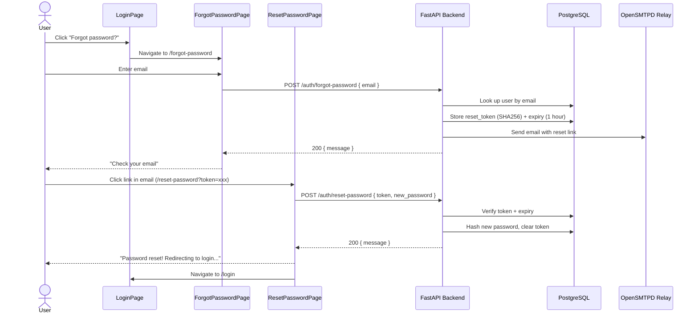

# Forgot Password Flow — Implementation Plan

## Overview

Add a full password reset flow to the Spectrum 4 Strata CRM. Users who forget their password can request a reset link via email, click a time-limited link, and set a new password.

## Architecture



## Changes Required

### 1. Database Migration (`api/alembic/versions/006_password_reset_token.py`)

Add two nullable columns to the `users` table:

| Column | Type | Notes |
|--------|------|-------|
| `password_reset_token` | `String(64)` | SHA-256 hex digest of the random token, nullable, unique index |
| `password_reset_token_expires_at` | `DateTime(timezone=True)` | nullable |

The token stored in the DB is a SHA-256 hash of the raw token sent in the email. This ensures the raw token is never persisted (the hash is the comparison value).

### 2. Backend Schemas (`api/app/schemas/auth.py`)

Add two new Pydantic models:

- **`ForgotPasswordRequest`**: `{ email: EmailStr }`
- **`ResetPasswordRequest`**: `{ token: str, new_password: str }` (with password length validation >= 10)

### 3. Backend Endpoints (`api/app/routers/auth.py`)

#### `POST /auth/forgot-password` (no auth, no CSRF, rate-limited)

1. Accept `{ email }`
2. Look up user by email (case-insensitive)
3. If user found and active:
   - Generate a cryptographically random token (32 bytes → 43 chars base64-urlsafe)
   - Store `SHA256(token)` in `password_reset_token`
   - Set `password_reset_token_expires_at = now + 1 hour`
   - Commit
   - Send email via `app/email.py` with a reset link: `https://crm.spectrum4.ca/reset-password?token=<raw_token>`
4. **Always return 200** — do not reveal whether the email exists (security best practice)
5. Rate limit: `5/15minute` per IP

#### `POST /auth/reset-password` (no auth, no CSRF)

1. Accept `{ token, new_password }`
2. Hash the raw token with SHA-256
3. Look up user where `password_reset_token == hash` AND `password_reset_token_expires_at > now`
4. If valid:
   - Hash new password with bcrypt
   - Clear `password_reset_token` and `password_reset_token_expires_at`
   - Set `password_reset_required = False`
   - Log audit action "password_reset"
   - Commit
   - Return 200
5. If invalid/expired: return 400 "Invalid or expired reset token"

### 4. Frontend API Client (`web/src/lib/api.ts`)

Add to `authApi` object:

```typescript
forgotPassword: (email: string) =>
  api.post<{ message: string }>("/auth/forgot-password", { email }),
resetPassword: (token: string, new_password: string) =>
  api.post<{ message: string }>("/auth/reset-password", { token, new_password }),
```

### 5. ForgotPasswordPage (`web/src/pages/ForgotPasswordPage.tsx`)

- Clean form with email input (similar styling to LoginPage)
- On submit: call `authApi.forgotPassword(email)`
- On success: show "If an account exists with that email, a reset link has been sent."
- On error: show error message
- Link back to "Return to sign in"
- No auth guard (public page)

### 6. ResetPasswordPage (`web/src/pages/ResetPasswordPage.tsx`)

- Read `token` from URL query parameter (`useSearchParams`)
- If no token in URL: show error "Invalid reset link"
- Form with new password + confirm password fields
- Password validation: minimum 10 characters, must match confirmation
- On submit: call `authApi.resetPassword(token, new_password)`
- On success: show success message, redirect to `/login` after 3 seconds
- Link to "Return to sign in"
- No auth guard (public page)

### 7. LoginPage Update (`web/src/pages/LoginPage.tsx`)

Add a "Forgot password?" link below the password field, styled as a small text link:

```tsx
<div className="flex items-center justify-end">
  <Link to="/forgot-password" className="text-sm text-blue-600 hover:text-blue-500">
    Forgot password?
  </Link>
</div>
```

### 8. App.tsx Route Updates (`web/src/App.tsx`)

Add two new public routes (outside `RequireAuth`):

```tsx
<Route path="/forgot-password" element={<ForgotPasswordPage />} />
<Route path="/reset-password" element={<ResetPasswordPage />} />
```

## Security Considerations

1. **Token is never stored in plaintext** — only SHA-256 hash in DB
2. **Token expires after 1 hour** — limits window of attack
3. **No email enumeration** — always returns 200 regardless of whether email exists
4. **Rate limiting** — 5 requests per 15 minutes on forgot-password endpoint
5. **No CSRF required** — these endpoints don't use sessions (user isn't logged in)
6. **Password strength** — reuses existing 10-character minimum requirement

## Files Modified

| File | Action |
|------|--------|
| `api/alembic/versions/006_password_reset_token.py` | **Create** — new migration |
| `api/app/models.py` | **Modify** — add `password_reset_token`, `password_reset_token_expires_at` columns |
| `api/app/schemas/auth.py` | **Modify** — add `ForgotPasswordRequest`, `ResetPasswordRequest` |
| `api/app/routers/auth.py` | **Modify** — add `forgot_password`, `reset_password` endpoints |
| `web/src/lib/api.ts` | **Modify** — add `forgotPassword`, `resetPassword` to `authApi` |
| `web/src/pages/ForgotPasswordPage.tsx` | **Create** — new page |
| `web/src/pages/ResetPasswordPage.tsx` | **Create** — new page |
| `web/src/pages/LoginPage.tsx` | **Modify** — add "Forgot password?" link |
| `web/src/App.tsx` | **Modify** — add routes for forgot/reset pages |
| `memory-bank/activeContext.md` | **Modify** — document new feature |
| `memory-bank/progress.md` | **Modify** — update status |
