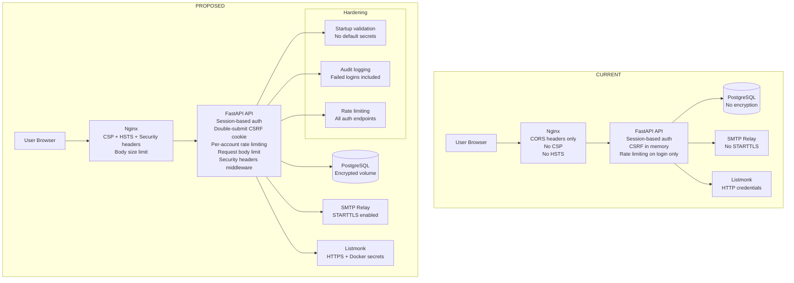

# Security Audit & Remediation Plan — Spectrum 4 Strata CRM

## Overview

This document presents a comprehensive security review of the Spectrum 4 Strata CRM application. Findings are organized by severity and grouped into logical work phases. Each finding includes the current risk, recommended fix, and implementation guidance.

---

## 🔴 Critical Severity

### C1. Hardcoded Default Credentials in Configuration

**Location:** [`api/app/config.py:8-9`](../api/app/config.py#L8), [`.env.example:2-3`](../.env.example#L2), [`docker-compose.yml:14,37,48`](../docker-compose.yml#L14)

**Issue:** The default `DATABASE_URL` contains `changeme` as the password. The `SECRET_KEY` default is `dev-secret-key-change-in-production-min-32-chars`. The `LISTMONK_PASSWORD` defaults to `changeme`. If production deployment fails to override these via environment variables, the app runs with well-known secrets.

**Risk:** Database compromise, session forgery, Listmonk account takeover.

**Fix:**
- Remove all default values for secrets from code — fail hard at startup if `SECRET_KEY`, `DB_PASSWORD`, and `LISTMONK_PASSWORD` are not set.
- Add a startup validation in [`api/app/config.py`](../api/app/config.py) that checks for known weak values and raises a clear error.

---

### C2. Session Middleware Uses Weak Default Secret Key

**Location:** [`api/app/main.py:197-204`](../api/app/main.py#L197)

**Issue:** The Starlette `SessionMiddleware` uses `settings.secret_key` which defaults to `dev-secret-key-change-in-production-min-32-chars`. This key signs the session cookie. An attacker who knows this key can forge arbitrary session cookies and impersonate any user.

**Risk:** Complete authentication bypass — full account takeover.

**Fix:**
- Enforce minimum 32-byte entropy requirement for `SECRET_KEY` at startup.
- Add a validation check that rejects known weak values.

---

### C3. No Rate Limiting on Password Reset Token Endpoint (Token Brute-Force)

**Location:** [`api/app/routers/auth.py:172-213`](../api/app/routers/auth.py#L172)

**Issue:** The `POST /reset-password` endpoint has **no rate limiting** (`@limiter.limit(...)` is absent). The reset token is a 32-byte URL-safe token, but without rate limiting, an attacker can make unlimited guesses. Additionally, the token is sent in the URL query parameter (`?token=...`) which may be logged by proxies, browsers, or referrer headers.

**Risk:** Password reset token brute-force; token leakage via referrer headers or server logs.

**Fix:**
- Add `@limiter.limit("5/15minute")` to the reset-password endpoint.
- Consider using a POST-only flow where the token is in the request body (already done), but ensure the frontend never exposes it in the URL bar after redirect.
- Add a `Referrer-Policy: no-referrer` header on the reset password page.

---

### C4. No Input Validation on Bulk Party Import (SQL Injection Surface)

**Location:** [`api/app/routers/parties.py:160-236`](../api/app/routers/parties.py#L160)

**Issue:** The bulk party import endpoint accepts arbitrary `list[BulkPartyRow]` and processes each row in a loop. While SQLAlchemy ORM usage prevents classic SQL injection, the `lot_unit` field is used to build a lookup dictionary and then matched against user input. More critically, there is **no limit on the number of rows** accepted — an attacker could send millions of rows to exhaust database connections or memory.

**Risk:** Denial of service via unbounded bulk import; potential data integrity issues.

**Fix:**
- Add a maximum row limit (e.g., 1000 rows per request).
- Add a timeout or streaming mechanism for large imports.
- Validate that `lot_unit` matches expected format (alphanumeric, max 20 chars).

---

## 🟠 High Severity

### H1. CSRF Token Stored in Memory Only — Lost on Hard Reload

**Location:** [`web/src/lib/api.ts:10-14`](../web/src/lib/api.ts#L10), [`web/src/hooks/useAuth.ts:12-13`](../web/src/hooks/useAuth.ts#L12)

**Issue:** The CSRF token is stored in a module-level JavaScript variable. On hard page reload (e.g., F5, Cmd+R), the token is lost. The `useMe()` hook restores it from the `/auth/me` response, but this creates a brief window where mutating requests could fail or behave unexpectedly. More importantly, if an XSS vulnerability exists, the in-memory CSRF token is trivially exfiltrated.

**Risk:** CSRF protection is fragile; single point of failure for XSS exfiltration.

**Fix:**
- Store the CSRF token in an HTTP-only cookie (set by the server) instead of in-memory JS variable.
- The server already has session cookies — consider using Double Submit Cookie pattern where the CSRF token is in both a cookie and header, and the server compares them.
- Alternatively, use SameSite=Strict cookies (already configured in production) which eliminates the need for CSRF tokens entirely for same-site requests.

---

### H2. No Content Security Policy (CSP) Headers

**Location:** [`web/nginx.conf:29-32`](../web/nginx.conf#L29)

**Issue:** The nginx config sets `X-Content-Type-Options`, `X-Frame-Options`, `X-XSS-Protection`, and `Referrer-Policy` but **no Content-Security-Policy** header. CSP is the most effective defense against XSS attacks.

**Risk:** If an XSS vulnerability is introduced, CSP is the last line of defense — currently absent.

**Fix:**
- Add a strict CSP header in nginx config:
  ```
  add_header Content-Security-Policy "default-src 'self'; script-src 'self'; style-src 'self' 'unsafe-inline'; img-src 'self' data:; font-src 'self'; connect-src 'self'; form-action 'self'; base-uri 'self'; frame-ancestors 'none';" always;
  ```
- Test thoroughly with the Vite dev build to ensure no inline scripts are blocked (Vite uses inline scripts in dev mode, but production builds use hashed filenames).

---

### H3. Password Change Endpoint Lacks Rate Limiting

**Location:** [`api/app/routers/auth.py:92-116`](../api/app/routers/auth.py#L92)

**Issue:** The `POST /change-password` endpoint has no rate limiting. An attacker with a valid session (e.g., via session fixation or stolen cookie) could attempt to brute-force the current password.

**Risk:** Password brute-force via authenticated session.

**Fix:**
- Add `@limiter.limit("5/15minute")` to the change-password endpoint.
- Consider logging failed password change attempts to the audit log.

---

### H4. Document Upload Path Traversal via Filename

**Location:** [`api/app/routers/documents.py:67-71`](../api/app/routers/documents.py#L67)

**Issue:** The `doc_safe()` function sanitizes filenames, but the storage path is constructed as `{entity_type}_{entity_id}_{sanitized_filename}`. If `entity_type` or `entity_id` contain path traversal characters (e.g., `../../etc/`), the file could be written outside the uploads directory. While `entity_type` is validated as a form field, it's not strictly validated against an allowlist.

**Risk:** Arbitrary file write on the server filesystem.

**Fix:**
- Validate `entity_type` against a strict allowlist (e.g., `{"lot", "infraction", "incident", "party", "notice"}`).
- Validate `entity_id` is a positive integer.
- Use UUID-based filenames instead of user-supplied names for storage.

---

### H5. No HSTS Header in Production Nginx Config

**Location:** [`web/nginx.conf:29-32`](../web/nginx.conf#L29)

**Issue:** The nginx config does not include `Strict-Transport-Security` header. While Traefik handles TLS termination in production, the nginx layer should also set HSTS to prevent downgrade attacks.

**Risk:** SSL stripping / downgrade attack if Traefik misconfiguration occurs.

**Fix:**
- Add `add_header Strict-Transport-Security "max-age=31536000; includeSubDomains" always;` to nginx config.

---

## 🟡 Medium Severity

### M1. Session Cookie `max_age` Set to 30 Days

**Location:** [`api/app/main.py:201`](../api/app/main.py#L201)

**Issue:** The session cookie has a 30-day maximum age. This is excessively long for a CRM application handling sensitive strata data. If a user's device is lost or compromised, the session remains valid for 30 days.

**Risk:** Extended window for session hijacking.

**Fix:**
- Reduce `max_age` to 8 hours (28800 seconds) for production.
- Consider implementing idle session timeout (reset `max_age` on each request).

---

### M2. No Account Lockout After Failed Login Attempts

**Location:** [`api/app/routers/auth.py:39-70`](../api/app/routers/auth.py#L39)

**Issue:** The login endpoint is rate-limited at 10 attempts per 15 minutes per IP, but there is **no per-account lockout**. An attacker can rotate IP addresses (e.g., via botnet) to bypass IP-based rate limiting and brute-force a specific account's password.

**Risk:** Distributed password brute-force across accounts.

**Fix:**
- Implement per-account rate limiting (track failed attempts per email in Redis or database).
- Temporarily lock the account after 10 consecutive failed attempts for 15 minutes.
- Log failed login attempts to the audit log with IP address.

---

### M3. Password Reset Token Doesn't Invalidate Previous Tokens

**Location:** [`api/app/routers/auth.py:134-141`](../api/app/routers/auth.py#L134)

**Issue:** When a new password reset is requested, the previous token is overwritten. However, if an attacker obtains an old reset email (e.g., via compromised email account), and the user requests a new reset, the old token is invalidated. This is partially mitigated, but there's no explicit invalidation of all existing tokens when a password is changed via any means.

**Risk:** Stale reset tokens could be used if not properly invalidated on password change.

**Fix:**
- When password is changed (via `/change-password`, `/reset-password`, or admin reset), clear any existing `password_reset_token` and `password_reset_token_expires_at`.

---

### M4. No Email Verification for New Users

**Location:** [`api/app/routers/auth.py:237-277`](../api/app/routers/auth.py#L237)

**Issue:** When an admin creates a new user, the account is immediately active with the assigned temporary password. There is no email verification step to confirm the user's email address is valid and under their control.

**Risk:** Account creation with typos in email addresses; potential for account take-over if temporary password is intercepted.

**Fix:**
- Send a verification email with a link the user must click before the account becomes active.
- Alternatively, at minimum, email the temporary password to the user (currently it's only returned in the API response to the admin).

---

### M5. No Audit Log for Failed Login Attempts

**Location:** [`api/app/routers/auth.py:39-70`](../api/app/routers/auth.py#L39)

**Issue:** Failed login attempts are not logged to the audit log. This makes it difficult to detect brute-force attacks or account compromise attempts.

**Risk:** Reduced visibility into security incidents.

**Fix:**
- Log failed login attempts to the audit log with IP address, email, and timestamp.
- Do NOT log the password (obviously).

---

### M6. Listmonk Credentials Sent Over HTTP

**Location:** [`api/app/routers/sync.py:47-53`](../api/app/routers/sync.py#L47), [`api/app/config.py:25-27`](../api/app/config.py#L25)

**Issue:** The `LISTMONK_BASE_URL` defaults to `http://listmonk:9000` (HTTP, not HTTPS). Credentials are sent in cleartext over the Docker internal network. While Docker networks are isolated, any compromised container on the same network could sniff these credentials.

**Risk:** Credential sniffing on internal Docker network.

**Fix:**
- Use HTTPS for Listmonk communication if Listmonk supports it.
- At minimum, ensure the Listmonk container is on a dedicated internal network with strict network policies.
- Consider using Docker secrets instead of environment variables for credentials.

---

### M7. SMTP Credentials Sent Over Unencrypted Connection

**Location:** [`api/app/email.py:53-55`](../api/app/email.py#L53), [`api/app/config.py:17-20`](../api/app/config.py#L17)

**Issue:** SMTP connection uses `smtplib.SMTP()` without STARTTLS. Credentials and email content are sent in cleartext.

**Risk:** Credential and data exposure on the network.

**Fix:**
- Use `smtplib.SMTP_SSL()` or call `.starttls()` after connecting.
- Add an `smtp_use_tls` configuration option.

---

## 🟢 Low Severity

### L1. Debug Mode Exposes API Documentation in Production

**Location:** [`api/app/main.py:175-178`](../api/app/main.py#L175)

**Issue:** The FastAPI docs (Swagger UI, ReDoc, OpenAPI schema) are disabled when `debug=False`. This is correct. However, the check is `if settings.debug` — ensure this is always `False` in production (the production docker-compose override sets `DEBUG: "false"` which is a string, not boolean).

**Risk:** Low — but string `"false"` is truthy in Python, so docs could be accidentally exposed.

**Fix:**
- In [`api/app/config.py`](../api/app/config.py), add a validator to coerce `debug` to boolean:
  ```python
  @field_validator("debug", mode="before")
  @classmethod
  def coerce_debug(cls, v):
      if isinstance(v, str):
          return v.lower() in ("true", "1", "yes")
      return bool(v)
  ```

---

### L2. No `Secure` Flag on Session Cookie in Production

**Location:** [`api/app/main.py:197-204`](../api/app/main.py#L197)

**Issue:** The `https_only` setting controls whether the session cookie has the `Secure` flag. In production, `HTTPS_ONLY=true` is set. However, if this env var is accidentally omitted, the cookie will be sent over HTTP.

**Risk:** Session cookie transmitted in cleartext.

**Fix:**
- Add a startup validation that enforces `https_only=True` when `debug=False`.
- Or simply hard-code `https_only=True` and only allow `False` in development.

---

### L3. No Request Body Size Limiting at the API Gateway

**Location:** [`web/nginx.conf:7`](../web/nginx.conf#L7)

**Issue:** `client_max_body_size` is set to 25m, which is reasonable. However, there's no limit on the API level for JSON request bodies. An attacker could send extremely large JSON payloads to exhaust memory.

**Risk:** Denial of service via oversized requests.

**Fix:**
- Add a middleware in FastAPI to limit request body size (e.g., 10 MB for JSON, 25 MB for multipart).
- Use FastAPI's built-in `max_body_size` parameter or a custom middleware.

---

### L4. No Security Headers on API Responses

**Location:** [`api/app/main.py`](../api/app/main.py)

**Issue:** Security headers (CSP, HSTS, X-Content-Type-Options) are set by nginx for the frontend, but API responses served directly (if accessed outside the nginx proxy) lack these headers.

**Risk:** Reduced defense-in-depth for API endpoints.

**Fix:**
- Add a FastAPI middleware that sets security headers on all responses:
  ```python
  @app.middleware("http")
  async def add_security_headers(request, call_next):
      response = await call_next(request)
      response.headers["X-Content-Type-Options"] = "nosniff"
      response.headers["X-Frame-Options"] = "DENY"
      return response
  ```

---

### L5. No Dependency Vulnerability Scanning

**Issue:** There is no automated scanning for known vulnerabilities in Python or JavaScript dependencies. The `requirements.txt` and `package.json` pin specific versions but don't check for CVEs.

**Risk:** Unpatched known vulnerabilities in dependencies.

**Fix:**
- Add `pip-audit` or `safety` to the CI pipeline for Python dependencies.
- Add `npm audit` to the CI pipeline for JavaScript dependencies.
- Consider Dependabot or Renovate for automated dependency updates.

---

### L6. No Database Encryption at Rest

**Issue:** PostgreSQL data directory is stored on a Docker volume without encryption. If the host filesystem is compromised, all CRM data (including personal information) is accessible.

**Risk:** Data breach via host compromise.

**Fix:**
- Enable PostgreSQL TDE (Transparent Data Encryption) or use filesystem-level encryption (LUKS).
- This is typically an infrastructure/DevOps concern rather than application code.

---

## 📋 Implementation Plan

### Phase 1 — Critical Fixes (Do First)
| Step | Description | Files |
|------|-------------|-------|
| 1.1 | Remove default secrets from config; add startup validation | [`api/app/config.py`](../api/app/config.py) |
| 1.2 | Enforce strong SECRET_KEY at startup | [`api/app/config.py`](../api/app/config.py) |
| 1.3 | Add rate limiting to reset-password endpoint | [`api/app/routers/auth.py`](../api/app/routers/auth.py) |
| 1.4 | Add max row limit to bulk party import | [`api/app/routers/parties.py`](../api/app/routers/parties.py) |

### Phase 2 — High Severity Fixes
| Step | Description | Files |
|------|-------------|-------|
| 2.1 | Improve CSRF token storage (Double Submit Cookie or SameSite) | [`api/app/main.py`](../api/app/main.py), [`web/src/lib/api.ts`](../web/src/lib/api.ts) |
| 2.2 | Add Content-Security-Policy header | [`web/nginx.conf`](../web/nginx.conf) |
| 2.3 | Add rate limiting to change-password endpoint | [`api/app/routers/auth.py`](../api/app/routers/auth.py) |
| 2.4 | Validate entity_type/entity_id in document upload | [`api/app/routers/documents.py`](../api/app/routers/documents.py) |
| 2.5 | Add HSTS header | [`web/nginx.conf`](../web/nginx.conf) |

### Phase 3 — Medium Severity Fixes
| Step | Description | Files |
|------|-------------|-------|
| 3.1 | Reduce session max_age; add idle timeout | [`api/app/main.py`](../api/app/main.py), [`api/app/config.py`](../api/app/config.py) |
| 3.2 | Implement per-account rate limiting / lockout | [`api/app/routers/auth.py`](../api/app/routers/auth.py) |
| 3.3 | Invalidate reset tokens on password change | [`api/app/routers/auth.py`](../api/app/routers/auth.py) |
| 3.4 | Send verification email on user creation | [`api/app/routers/auth.py`](../api/app/routers/auth.py) |
| 3.5 | Log failed login attempts to audit log | [`api/app/routers/auth.py`](../api/app/routers/auth.py) |
| 3.6 | Use STARTTLS for SMTP | [`api/app/email.py`](../api/app/email.py), [`api/app/config.py`](../api/app/config.py) |

### Phase 4 — Low Severity / Hardening
| Step | Description | Files |
|------|-------------|-------|
| 4.1 | Fix boolean coercion for DEBUG env var | [`api/app/config.py`](../api/app/config.py) |
| 4.2 | Enforce Secure cookie flag in production | [`api/app/config.py`](../api/app/config.py), [`api/app/main.py`](../api/app/main.py) |
| 4.3 | Add request body size limiting middleware | [`api/app/main.py`](../api/app/main.py) |
| 4.4 | Add security headers middleware to FastAPI | [`api/app/main.py`](../api/app/main.py) |
| 4.5 | Add dependency scanning to CI | CI config files |

---

## 🔒 Security Architecture Diagram (Current vs Proposed)



---

## Summary of Findings

| Severity | Count | Key Areas |
|----------|-------|-----------|
| 🔴 Critical | 4 | Default secrets, weak session key, missing rate limits, unbounded bulk import |
| 🟠 High | 5 | CSRF fragility, missing CSP, path traversal risk, missing HSTS, password change rate limit |
| 🟡 Medium | 7 | Long session TTL, no account lockout, token invalidation, no email verification, audit gaps, HTTP credentials, no STARTTLS |
| 🟢 Low | 6 | Debug boolean coercion, Secure flag enforcement, body size limits, API security headers, dependency scanning, DB encryption |
| **Total** | **22** | |

